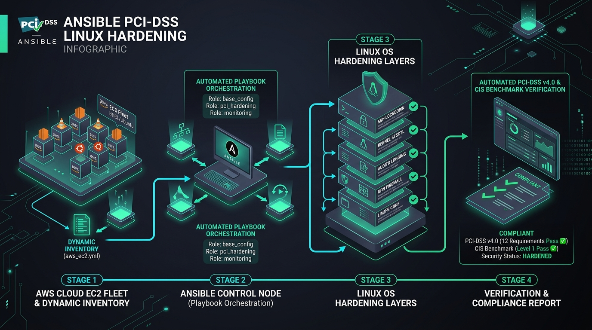

# Ansible PCI-DSS v4.0 & CIS Linux Hardening Framework

[](https://www.ansible.com/)
[](https://www.pcisecuritystandards.org/)
[](https://www.cisecurity.org/)
[](https://aws.amazon.com/ec2/)
[](LICENSE)

An enterprise-ready, modular Ansible orchestration suite designed to automate and enforce **PCI-DSS v4.0** and **CIS Linux Benchmark (Level 1 Server)** security baselines across cloud-native Linux fleets (Ubuntu/Debian, RHEL/Rocky Linux). 

Built specifically for high-throughput, latency-critical fintech environments (e.g., **Razorpay payment processing nodes, API gateways, and tokenization services**), this framework combines host-level lockdown with **zero-downtime rolling executions (`serial: 25%`)** and **AWS EC2 dynamic inventory** discovery.

---

## Architecture & Pipeline Overview



### High-Level Architecture Flow:
1. **Cloud Discovery**: Dynamic instance discovery using `amazon.aws.aws_ec2` inventory plugin filtered by security tags (`PciScope=true`, `Environment=production`).
2. **Orchestration Engine**: Central Ansible control node executing modular playbooks with pre-flight syntax checks, privilege escalation validation, and rolling batch updates.
3. **Defense-in-Depth Hardening**:
   - **SSH Lockdown**: Enforces modern elliptic curve cryptography, disables password authentication, and enforces 10-minute idle session terminations.
   - **Kernel & Network Sysctl**: Hardens TCP/IP stack against SYN floods, disables ICMP redirects, enforces strict reverse path filtering (`rp_filter`), and activates ASLR.
   - **Audit & Compliance (`auditd`)**: Monitors sensitive identity stores (`/etc/passwd`, `/etc/sudoers`), logs privilege escalations, and locks rules immutably (`-e 2`).
   - **Resource Limits (`limits.conf`)**: Allocates file descriptors and process limits tailored for high-concurrency payment APIs.
   - **Stateful Host Firewall**: Enforces default deny ingress, rate-limits SSH, and restricts ingress to authorized payment gateways.
4. **Continuous Compliance & Verification**: Automated audit checks and configuration drift validation using Ansible dry-run (`--check --diff`) and ad-hoc compliance modules.

---

## PCI-DSS v4.0 & CIS Benchmark Mapping Matrix

| PCI-DSS v4.0 Control | CIS Benchmark | Target Area | Ansible Implementation / Role | Enforced Security State |
|:---|:---|:---|:---|:---|
| **Req 1.3 / 1.4** | 3.5.1 - 3.5.3 | Host Firewall | `roles/firewall` | Default deny ingress; strict port restriction (443, rate-limited SSH 22). |
| **Req 2.2** | 1.1 - 2.3 | System Baseline | `roles/common` | Unnecessary services disabled; legal authorization warning banner (`/etc/motd`). |
| **Req 2.2.4** | 3.2.1 - 3.2.8 | Network Stack Hardening | `roles/sysctl_hardening` | TCP SYN cookies enabled; packet redirect and source-routing disabled; ASLR enabled. |
| **Req 8.2 / 8.3** | 5.2.1 - 5.2.22 | SSH Access Control | `roles/ssh_hardening` | `PermitRootLogin no`, `PasswordAuthentication no`, strong ciphers (`chacha20`, `aes256-gcm`). |
| **Req 8.1.7** | 5.2.15 | Idle Session Termination | `roles/ssh_hardening` | `ClientAliveInterval 300`, `ClientAliveCountMax 2` (Max 10 minutes inactive disconnect). |
| **Req 10.2 / 10.3** | 4.1.1 - 4.1.17 | Audit Logging | `roles/audit_and_limits` | `auditd` rules for `/etc/shadow`, `/etc/sudoers`, execution of `setuid`/`setgid` binaries. |
| **Req 10.5** | 4.1.18 | Audit Immutability | `roles/audit_and_limits` | Kernel audit rules set to immutable (`-e 2`), requiring reboot to alter. |
| **Req 11.2** | 1.3.1 | Integrity Checks | `roles/audit_and_limits` | Sudo and user limits configured; core dumps disabled (`fs.suid_dumpable = 0`). |

---

## Project Structure

```bash
ansible-linux-hardening-pci/
├── ansible.cfg                    # Optimized Ansible configuration (pipelining, paths)
├── playbook.yml                   # Master orchestration playbook (serial: 25%)
├── requirements.yml               # External Galaxy collections (ansible.posix, amazon.aws)
├── inventory/
│   ├── hosts.ini                  # Static inventory for local & staging topologies
│   └── aws_ec2.yml                # AWS dynamic inventory keyed by PCI tags & regions
├── roles/
│   ├── common/                    # Baseline MOTD, legal banner, security tools
│   ├── ssh_hardening/             # Cryptographic SSH lockdown & idle timeouts
│   ├── sysctl_hardening/          # Kernel TCP/IP & memory parameter tuning
│   ├── audit_and_limits/          # Auditd PCI rules & system limits (nofile 65535)
│   └── firewall/                  # Stateful UFW / iptables policy
├── tests/
│   └── verify_pci_controls.sh     # Automated post-hardening compliance audit script
└── docs/
    └── images/                    # Visual architecture and terminal demo assets
```

---

## Quick Start Guide

### 1. Prerequisites
- **Ansible Core**: `>= 2.14`
- **Python**: `>= 3.9` with `boto3` (for AWS dynamic inventory)
- Target Nodes: Ubuntu 20.04/22.04 LTS, Debian 11/12, or RHEL/Rocky Linux 8/9

Install required Ansible collections:
```bash
ansible-galaxy collection install -r requirements.yml
```

### 2. Configure Inventory

#### Option A: Static Inventory (Testing & Staging)
Edit `inventory/hosts.ini`:
```ini
[payment_gateways]
pg-prod-01 ansible_host=10.0.10.5 ansible_user=ubuntu
pg-prod-02 ansible_host=10.0.10.6 ansible_user=ubuntu

[database_nodes]
db-prod-01 ansible_host=10.0.20.10 ansible_user=ubuntu

[pci_scope:children]
payment_gateways
database_nodes
```

#### Option B: AWS EC2 Dynamic Inventory (Production)
Verify dynamic inventory discovery across AWS payment VPCs:
```bash
ansible-inventory -i inventory/aws_ec2.yml --graph
```

### 3. Syntax Verification & Dry Run (Check Mode)
Run a syntax check and non-intrusive diff:
```bash
# Syntax Validation
ansible-playbook --syntax-check playbook.yml -i inventory/hosts.ini

# Dry Run / Check Mode with Diffs
ansible-playbook -i inventory/hosts.ini playbook.yml --check --diff
```

### 4. Execute Hardening Playbook
Run the master playbook with privilege escalation:
```bash
ansible-playbook -i inventory/hosts.ini playbook.yml --ask-become-pass
```

> **Zero-Downtime Guarantee:** The playbook executes with `serial: 25%` and checks for active payment daemon health before moving to the next node batch.

---

## 🔍 Automated Compliance & Verification Suite

Verify that all target nodes satisfy PCI-DSS v4.0 and CIS Level 1 benchmarks using the included audit script:

```bash
# Run locally or execute on target nodes
chmod +x tests/verify_pci_controls.sh
./tests/verify_pci_controls.sh
```

### Verification via Ansible Ad-Hoc Modules:
```bash
# Verify SSH hardening parameters across payment fleet
ansible payment_gateways -i inventory/hosts.ini -m command -a "sshd -T" | grep -E "permitrootlogin|passwordauthentication|clientaliveinterval"

# Verify kernel hardening sysctl settings
ansible pci_scope -i inventory/hosts.ini -m command -a "sysctl net.ipv4.tcp_syncookies net.ipv4.conf.all.rp_filter kernel.randomize_va_space"

# Verify auditd status and immutable mode
ansible pci_scope -i inventory/hosts.ini -m command -a "auditctl -s"
```

### Dry Run & Drift Detection:
```bash
# Run in check mode to ensure zero unintended drift
ansible-playbook -i inventory/hosts.ini playbook.yml --check --diff
```

---

## Key Role Deep Dives

### `roles/ssh_hardening`
- **FIPS/CIS Approved Ciphers**:
  `chacha20-poly1305@openssh.com,aes256-gcm@openssh.com,aes128-gcm@openssh.com`
- **Key Exchange (KEX)**:
  `curve25519-sha256,curve25519-sha256@libssh.org,diffie-hellman-group16-sha512`
- **Pre-Validation**: Configuration is validated via `sshd -t -f %s` before the service is restarted, preventing operator lockouts.

### `roles/sysctl_hardening`
- **Anti-Spoofing**: Enforces strict reverse path validation on all network interfaces (`net.ipv4.conf.all.rp_filter = 1`).
- **Denial-of-Service Defense**: Enables `tcp_syncookies = 1` and limits maximum orphaned sockets and SYN backlogs.
- **Memory Defense**: Sets `kernel.randomize_va_space = 2` to prevent memory corruption and buffer overflow exploits.

### `roles/audit_and_limits`
- **Identity Integrity**: Tracks any syscall modifying `/etc/passwd`, `/etc/group`, `/etc/shadow`, and `/etc/security/opasswd`.
- **System Call Tracking**: Monitors `execve` for privileged commands (`sudo`, `su`, `setuid`).
- **High Concurrency Optimization**: Adjusts `nofile` to `65535` for both soft and hard limits to handle peak payment transaction bursts.

---

## License
This project is licensed under the MIT License - see the [LICENSE](LICENSE) file for details.
